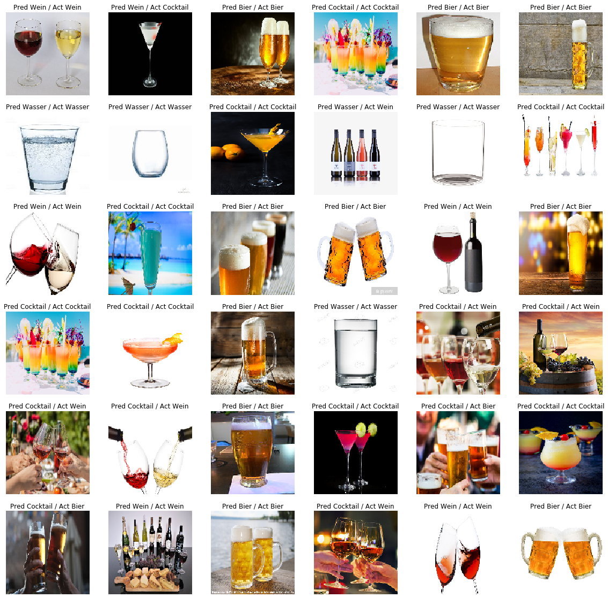

# drink-detection

## Fancy machine learning application that can detect the type of the drink in a picture

## Definition and training of models

The models are defined in the [notebook](./notebook.ipynb).
The training data is located in the folder images/cleaned.

## Usage of trained models for image classification

The trained models are used to predict the class of an image in [prediction](./prediction.ipynb).
The test images are located in the folder images/to_predict.

## Analysis of model qualities

The quality of the models is analyzed in [analysis](./analysis.ipynb).
